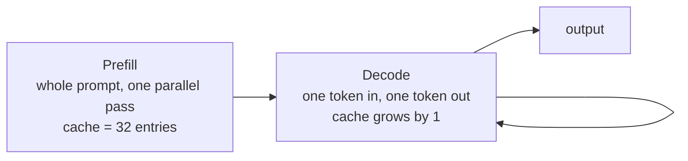

# 01 — KV Cache

## Principle

A language model generates one token at a time, and each new token attends over
everything before it. Done naively, generating token $n$ re-encodes all $n-1$
previous tokens, so the total cost is $1 + 2 + \dots + n \approx O(n^2)$.

The redundancy is avoidable. In

$$\text{Attention}(Q, K, V) = \text{softmax}\!\left(\frac{QK^T}{\sqrt{d_k}}\right)V$$

only $Q$ depends on the token being generated right now. The $K$ and $V$ of every
earlier token were fixed the moment that token was processed. So cache them and
reuse them, and each step costs a constant amount of work instead of a growing one.

## Two phases



- **Prefill** is compute-bound: a big matmul over the full prompt. It sets TTFT.
- **Decode** is memory-bound: one skinny matmul per step, dominated by reading the
  cache and the weights. It sets TPOT.
- These are different workloads with different SLOs, which is why they are timed
  separately in the demo.

## What the code does

Beyond the textbook version, [KV_Cache.py](KV_Cache.py) makes the five choices real
serving stacks make:

- **Pre-allocated cache, written in place.** Growing a tensor with `torch.cat`
  reallocates and copies the whole cache every step — $O(n^2)$ memory traffic on
  the hottest path. `KVCache.length` bounds every read, so clearing between
  requests is a counter assignment, not a memset.
- **Grouped-query attention.** Queries keep 8 heads, keys and values use 2. The
  cache shrinks 4× for a small quality cost — the single biggest KV-memory lever.
- **`F.scaled_dot_product_attention`.** Dispatches to fused FlashAttention or
  memory-efficient kernels instead of materialising the `[s_q, s_k]` score matrix.
- **Sampling with a stop condition.** Temperature and top-p, not argmax for a
  fixed count.
- **Last-position logits only.** Skips a `[seq_len, vocab]` projection per step.

One subtlety worth knowing: `is_causal=True` aligns the mask to the **top left**,
so it is only correct when $s_q = s_k$. During decode $s_q = 1$ and the single
query must see the whole cache, so causal masking is switched off.

## Results

```
                     wall      TTFT      TPOT   tokens/s
no KV cache         1.98s         -         -       96.7
KV cache            1.34s      7.2ms     6.99ms      143.0

identical output : True
KV per token     : 2048 B (8 q-heads / 2 kv-heads, 4x smaller than MHA)
```

The speedup looks modest only because the model is tiny; the gap widens with
sequence length and model size. `identical output: True` is the point — caching
changes the cost, never the answer.

## Run

```powershell
python KV_Cache.py
```

Source: [KV Caching in LLMs: A Guide for Developers](https://machinelearningmastery.com/kv-caching-in-llms-a-guide-for-developers/)
