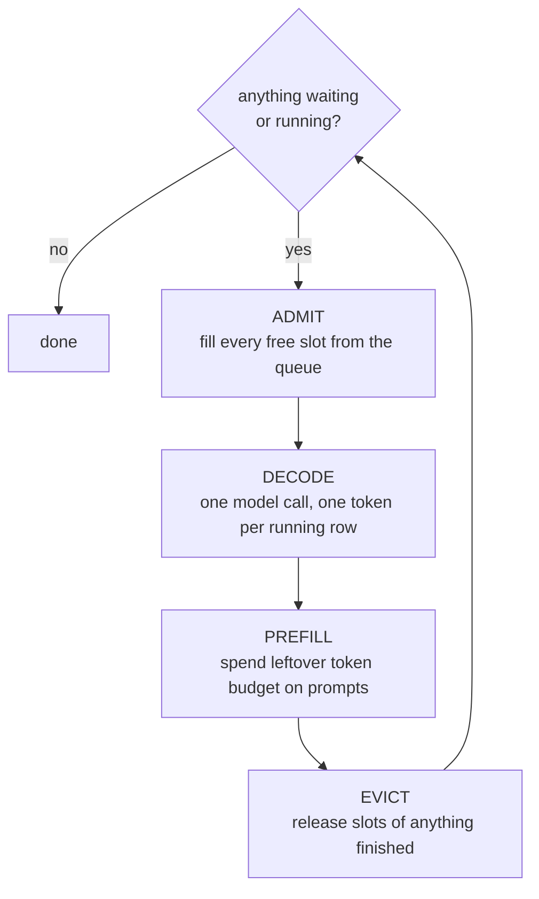

# 02 — Continuous (In-Flight) Batching

## Principle

Batching is how you keep a GPU busy: many requests share one pass over the
weights, so the cost of loading them is amortised. The catch is that requests
finish at wildly different times — one completion is 10 tokens, the next is 1,000.

**Static batching** forms a fixed group and runs it to completion. A sequence that
finishes early keeps occupying its place in the batch, still being computed, its
output thrown away, until the slowest member is done. Nothing new can start until
the whole group drains.

**Continuous batching** re-forms the batch every single step. A finished sequence
is evicted the moment it completes and a queued one takes its place immediately.
Same model, same math, same answers — only the seating policy changes.

## The loop



## Ragged lengths, without padding

Rows in a decode batch sit at completely different positions. There is still no
padding, because:

- Every row contributes exactly **one** token during decode, so the input tensor
  is already rectangular. The variation lives in the *history*, which is in the cache.
- The cache is a fixed rectangle by construction — `[max_batch, kv_heads, max_seq_len, d_k]`.
  What varies is how much of each row is valid.
- A **per-row mask**, `arange(k_len) <= positions`, cuts each row off at its own
  position. That one bound enforces causality *and* hides whatever a previous
  occupant of the slot left behind — which is what makes evicting a slot free.

## Chunked prefill

A long prompt is one huge forward pass. Without chunking it cannot be split, so it
overruns the step's token budget and every running decode stalls for its full
duration. Chunked prefill slices the prompt to fit the budget and interleaves it
with decodes.

- Bounds the worst inter-token stall — the metric it exists to fix.
- Costs a little throughput and TTFT: more, smaller kernel launches.
- Controlled by `max_num_batched_tokens`, exactly as in vLLM.

## Results

24 requests, batch 8, 128-token step budget, RAG-shaped prompts (128–512 tokens),
completions 14–154 tokens:

```
                          wall  batch util    tok/s  TTFT p50  TTFT p99     TPOT  max stall
static                   6.10s       57.1%    311.2     2.31s     3.97s    14.8ms       141ms
continuous               3.85s      100.0%    492.9     1.52s     2.94s    14.0ms        36ms
continuous + chunked     4.32s      100.0%    439.2     1.75s     3.46s    14.8ms        33ms

wasted row-steps : static 1407, continuous 0
identical output : True
```

- Static threw away **43%** of everything it computed. 1407 sequence-steps of pure waste.
- Continuous batching gets 1.6× the throughput and cuts latency, purely by not
  computing rows nobody is waiting for.
- Chunked prefill trades a little of that back for a smoother token stream.

## The limitation this leaves behind

```
slot cache : 16.0 MiB reserved for 8 x 1024 tokens, 9775 tokens ever live
```

Every sequence gets a contiguous slot sized for the worst case, so a 300-token
request still reserves 1024. `max_batch` is fixed at allocation time — you cannot
run a 9th sequence even if the 8 running ones are 20 tokens long.
That is what [../03-paged-attention](../03-paged-attention) fixes.

## Run

```powershell
python InFlight_Batching.py
```

Source: [Mastering LLM Techniques: Inference Optimization](https://developer.nvidia.com/blog/mastering-llm-techniques-inference-optimization/)
