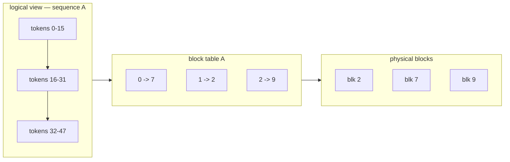

# 03 — PagedAttention

## Principle

Give every sequence a contiguous buffer sized for the worst case and most of that
memory is never touched. The vLLM paper measured **60–80% waste** in systems built
that way. Since KV-cache size is what caps how many requests you can run at once,
that waste is throughput thrown away.

PagedAttention borrows the fix from operating systems: **virtual memory**. Split
the cache into small fixed-size blocks, allocate them on demand as a sequence
grows, and give each sequence a **block table** mapping its logical positions to
scattered physical blocks. A sequence's KV no longer has to be contiguous, so it
no longer has to be reserved up front.

## Block table



Two sequences that begin with the same system prompt simply point their first
entries at the **same** physical blocks — that is prefix sharing, for free.

## What is implemented

- **`BlockAllocator`** — free list plus reference counts, so a block can have
  several owners.
- **`slot_mapping`** — a flat physical index per token, used to scatter K/V into
  the cache. The same expression handles prefill chunks and single decode tokens.
- **`gather`** — pulls scattered blocks back into logical order for attention. A
  real kernel fuses this in; here it is materialised so you can see it.
- **Copy-on-write** — a borrower that writes into a shared *partial* block forks
  it first. The demo's 200-token prefix is deliberately not a multiple of 16, so
  this path actually fires.
- **Recompute preemption** — when blocks run out, the newest sequence (LIFO, like
  vLLM) is evicted and re-prefilled later. LIFO is what guarantees forward
  progress: the oldest sequences always finish.
- **Admission watermark** — new work is refused while memory is tight, otherwise
  preemption thrashes.

## Results

12 requests sharing a 200-token system prompt:

```
                        blocks    wall   tok/s   peak   density  preempt  recomp   TTFT p50
roomy, no sharing          400   2.15s   363.8    160     0.97x        0       0      0.42s
tight + prefix reuse        64   2.23s   351.0     64     2.26x       12     925      0.16s

identical output   : True
paged peak         : 2.0 MiB in 64 blocks (1024 slots) addressing 2311 tokens
slot equivalent    : 16.0 MiB (8 x 1024 reserved) -> 8.0x more memory
same budget holds  : 8 sequences paged vs 1 with fixed slots
```

**Density** is tokens addressed per physical slot:

- `0.97x` without sharing — near-perfect packing. The only waste is the tail of
  each sequence's last block, which is the bound PagedAttention promises: at most
  one partial block per sequence.
- `2.26x` with sharing — blocks being read by more than one sequence at once.

The last line is the headline. In the same memory, fixed slots hold **1** sequence;
paging holds **8**. That is where the throughput comes from — not from a faster
kernel, but from being able to keep the batch full.

`identical output: True` across the roomy and the preempting runs validates the
eviction, recompute and copy-on-write paths together.

## Run

```powershell
python PagedAttention.py
```

Source: Kwon et al., *Efficient Memory Management for Large Language Model Serving
with PagedAttention*, SOSP 2023 — [arXiv:2309.06180](https://arxiv.org/abs/2309.06180)
