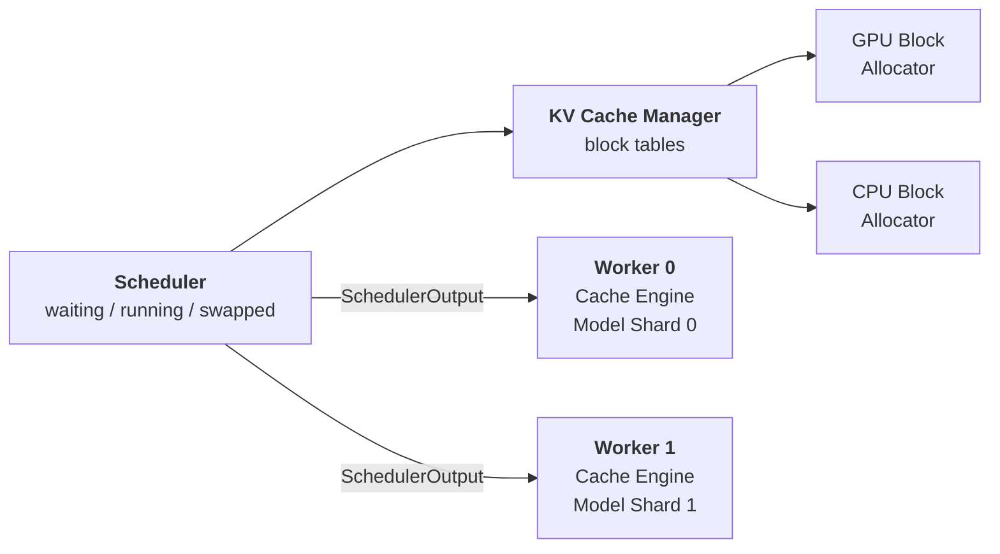
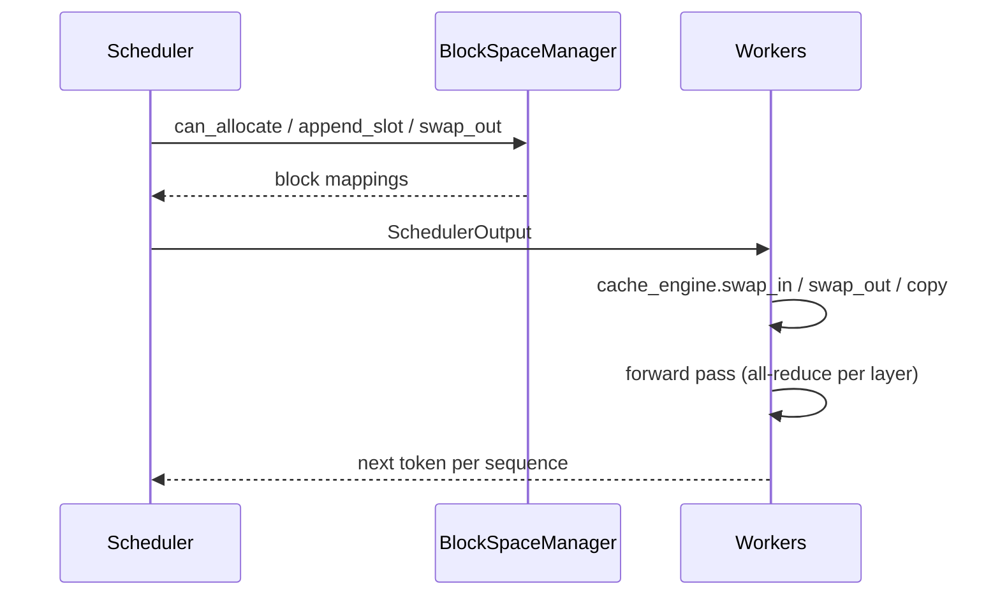

# 04 — The vLLM Architecture, End to End

## Principle

The whole design rests on one separation: **the KV cache manager never touches a
tensor.** It moves block *numbers* around and hands the workers three
dictionaries. Policy lives in one place, bytes move in another.

That is why the same scheduler works whether you have one GPU or eight, whether
memory pressure is resolved by recomputing or by swapping to host RAM. The
scheduler decides, the cache manager maps, the workers execute.

## System



The message on those arrows is the entire worker interface:

```python
@dataclass
class SchedulerOutput:
    scheduled: list[Sequence]
    blocks_to_swap_in:  dict[int, int]   # host block  -> device block
    blocks_to_swap_out: dict[int, int]   # device block -> host block
    blocks_to_copy:     dict[int, int]   # device -> device, copy-on-write
```

Every worker receives the identical plan and applies it to its own shard.

## One step



Cache movement always happens **before** the forward pass. In real vLLM it runs on
a separate CUDA stream so it overlaps.

## Components

| Diagram box | Class | Responsibility |
|---|---|---|
| Scheduler | `Scheduler` | three queues, FCFS, preemption policy |
| KV Cache Manager | `BlockSpaceManager` | `can_allocate`, `append_slot`, `swap_in/out`, `free` |
| Block tables | `BlockSpaceManager.tables` | `seq_id -> [physical block ids]` |
| GPU / CPU Block Allocator | `BlockAllocator` × 2 | free lists with reference counts |
| Cache Engine | `CacheEngine` | this rank's KV shard on device + host swap pool |
| Model Shard | `ShardedAttention`, `ShardedMLP` | this rank's slice of the weights |

### Scheduling rules worth knowing

- Prefill has priority — **except** when sequences are stranded on the host.
  Reclaiming swapped work beats starting new work.
- Under pressure the **newest** sequence is preempted, so the oldest always finish.
- After a preemption, swap-in is skipped for that step. Without that guard the
  scheduler oscillates.

### Preemption: two ways out

- **Recompute** — free the blocks, re-prefill the tokens later. Cheap in memory,
  pays in redundant compute.
- **Swap** — move the blocks to host RAM. The K/V survives, so nothing is
  recomputed; you pay PCIe bandwidth instead.

## Tensor parallelism

Megatron-style sharding across the attention heads:

- **Column-parallel** (`W_Q`, `W_K`, `W_V`, MLP up-projection) — split the output
  dimension. Each rank computes its own heads.
- **Row-parallel** (`W_O`, MLP down-projection) — split the input dimension, so
  each rank produces a *partial sum* that an all-reduce completes.
- The **KV cache is sharded too**. With `tp=2` and 2 KV heads, each rank stores
  exactly one KV head — 1.0 MiB each rather than 2.0 MiB replicated.
- Weights are generated once from a seed and then sliced, which is what makes the
  `tp=1` vs `tp=2` equivalence check meaningful.

## Results

12 requests sharing a 200-token system prompt, 64 GPU blocks / 128 CPU blocks:

```
                      wall   tok/s  steps  peak  preempt  recomp  swap out  swap in  CoW  hits
tp=1, recompute      1.68s   465.8    181    64        5     458         0        0    9    14
tp=2, recompute      1.71s   458.6    181    64        5     458         0        0    9    14
tp=2, swap           1.69s   465.2    170    64        5       0        29       29    5     9

identical output    : True
KV cache on device  : 2.0 MiB across 2 workers (1.0 MiB each, 1 kv-head per rank)
bytes swapped       : 0.5 MiB moved between device and host
```

Two correctness claims fall out of that single `True`:

- **tp=1 ≡ tp=2** — the head sharding, the row/column split and the all-reduce are right.
- **recompute ≡ swap** — the block tables survive eviction either way.

And the preemption tradeoff is visible in one row: swapping does **0** recomputed
tokens instead of 458, paid for with 29 blocks moved each direction.

## Simulation caveats

This runs in one process on one device, so three things stand in for the real thing:

- Workers are driven layer by layer and their partial outputs summed, in place of
  an NCCL all-reduce between separate processes.
- The "CPU" pool is a second tensor allocation, so a swap is a real copy between
  two distinct buffers even without a GPU.
- A prefill batch executes one sequence at a time; vLLM flattens them into a
  single variable-length kernel launch.

## Run

```powershell
python vLLM_Architecture.py
```

Source: Kwon et al., SOSP 2023 — [arXiv:2309.06180](https://arxiv.org/abs/2309.06180)
