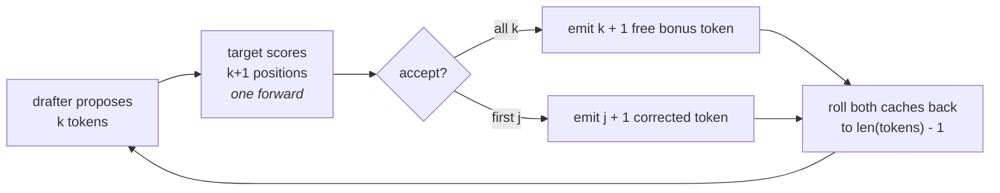

# 05 — Speculative Decoding

## Principle

Decode is **memory-bandwidth bound, not compute bound**. Every step streams the
entire weight matrix out of HBM to produce one token per sequence. With $P$
parameters at 2 bytes and batch $B$:

$$\text{arithmetic intensity} \approx \frac{2PB \text{ FLOPs}}{2P \text{ bytes}} = 2B \text{ FLOPs/byte}$$

Modern accelerators need a few hundred FLOPs per byte to saturate. At $B = 8$
you're at 16 — the compute units are idle, waiting on memory. Projects 02 and 03
raised $B$; memory runs out long before the ratio does.

Speculative decoding attacks the numerator instead. A cheap drafter proposes $k$
tokens, and the target **verifies all $k$ in one forward pass** — possible because
the candidates are already known, so they can be scored in parallel exactly like a
prefill. One weight load now yields up to $k+1$ accepted tokens.

## The round



**Cache rollback is the engineering core.** Rejected proposals left K/V behind
that must disappear before the next round. Because `length` bounds every read,
discarding them is a subtraction — the same trick projects 02 and 03 use to make
slot and block eviction free.

The invariant that keeps it simple: *at the top of every round, each cache covers
all tokens except the last one.* Feed each model whatever it hasn't cached; roll
everything back to `len(tokens) - 1` at the end.

## It is not an approximation

- **Greedy** — accept a proposal only if it equals the target's own argmax. The
  emitted sequence is byte-identical to plain greedy decoding.
- **Sampling** — accept with probability $\min\!\left(1, \frac{p_{\text{target}}(x)}{p_{\text{draft}}(x)}\right)$,
  otherwise resample from the normalised residual $\max(0, p_{\text{target}} - p_{\text{draft}})$.
  The accepted stream is drawn from *exactly* the target's distribution.

Prompt lookup is a clean special case: its proposal is a point mass, $q(x) = 1$,
so acceptance reduces to $p_{\text{target}}(x)$.

## Why this one trains first

Acceptance rate is the whole game, and it's meaningless unless the draft and
target genuinely agree — with random weights they agree at chance and speculation
is a straight loss.

So both models train for ~30s on a **synthetic phrase language**: sequences built
by concatenating short fixed phrases. Inside a phrase the next token is
determined and both models get it right; at a phrase boundary it's a near-uniform
choice among 48 phrases and they disagree. Average phrase length is 6, so roughly
one token in six is genuinely hard.

That is the shape of real text — most tokens easy, a few not — and it is the
entire reason the technique pays off.

## Two drafters

- **Draft model** — 1 layer, `d_model` 64, roughly 1/24 the cost of the 6-layer
  target. Runs $k$ times per round, so it must be *much* cheaper than the target.
- **Prompt lookup** — no model at all. Find the last occurrence of the current
  3-gram and propose what followed it. Free, and effective whenever the output
  quotes the input: summarisation, code editing, retrieval answers.

## Results

```
6-layer d128 target / 1-layer d64 draft, trained 36s (loss 0.70 / 0.88)

                          wall      TPOT  target fwd  draft fwd  tok/fwd   accept  speedup
baseline                 0.51s     3.95ms         128          0     1.00     0.0%     1.00x
draft model, k=2         0.37s     2.87ms          68        136     1.88    44.1%     1.38x
draft model, k=4         0.40s     3.09ms          57        228     2.25    31.6%     1.28x
draft model, k=8         0.55s     4.31ms          54        432     2.37    17.4%     0.92x
prompt lookup, k=4       0.43s     3.38ms          96          0     1.33    42.9%     1.17x
prompt lookup, k=8       0.40s     3.14ms          92          0     1.39    32.1%     1.26x

identical output : True
```

The interesting part is that **two metrics disagree**:

- `tok/fwd` improves monotonically with $k$ — 1.88 → 2.25 → 2.37. More speculation
  always means fewer target forwards.
- **Wall time turns over.** $k$ = 8 is *slower than baseline* (0.92×).

Because draft cost grows linearly in $k$ while acceptance decays roughly
geometrically. Accepting 17% of 8 proposals means ~6.6 of them are thrown away,
and you paid for all 8. **$k$ has an optimum**, and it depends on the draft/target
cost ratio and the acceptance rate — which is why production servers tune it per
workload, and why adaptive-$k$ schemes exist.

`identical output: True` across every configuration is the proof that all of this
is a pure cost optimisation.

## Run

```powershell
python speculative_decoding.py
```

Trains two small models first (~30s), then benchmarks. Timings are best-of-two
after a warmup, since wall-clock on a busy CPU is noisy; `target fwd` is the
deterministic metric.

Sources: Leviathan et al., *Fast Inference from Transformers via Speculative
Decoding* ([arXiv:2211.17192](https://arxiv.org/abs/2211.17192)) · Chen et al.,
*Accelerating Large Language Model Decoding with Speculative Sampling*
([arXiv:2302.01318](https://arxiv.org/abs/2302.01318))
