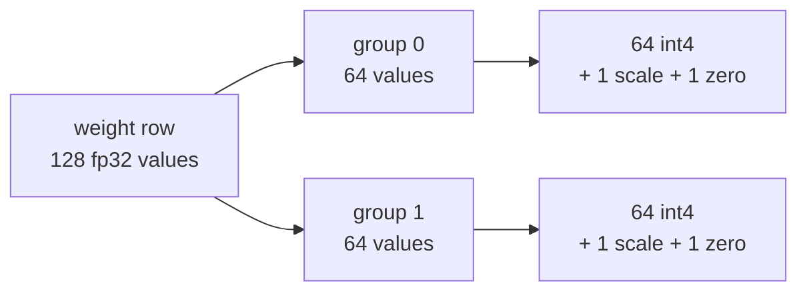

# 06 — Quantization

## Principle

Project 05 established that decode is **bandwidth bound**. So the two things
worth shrinking are the two things streamed out of memory every step.

- **Weights** are read once per decode step regardless of batch size. At 8 or 4
  bits that traffic drops 2× or 4×.
- **The KV cache** is read once per step *per sequence*, and it's what caps
  concurrency. Halving bytes per token doubles the blocks that fit, which doubles
  the batch — and that is where the throughput from project 03 actually came from.

Both use affine quantization over small groups:

$$s = \frac{\max - \min}{2^b - 1}, \quad z = \text{round}\!\left(\frac{-\min}{s}\right), \quad q = \text{clamp}\!\left(\text{round}\!\left(\frac{w}{s}\right) + z,\ 0,\ 2^b - 1\right)$$

and recover $\hat{w} = (q - z) \cdot s$.

## Group size is the entire tradeoff

One scale for a whole tensor is cheap to store and inaccurate. One scale per 16
values is accurate, and the scales themselves start costing real memory. That
tension is visible directly in the results below — it's the single most important
thing to internalise about quantization.



4-bit values are genuinely packed two per byte, so the reported sizes are real.

## Where quantization happens

- **Weights** — once, offline. `QuantizedLinear` holds packed integers and
  dequantizes in the forward pass. Embeddings and LayerNorms stay in fp32, which
  is what production recipes do.
- **KV cache** — on write, per `(head, token)`. This is natural: a token's K/V is
  finished the moment it's produced, so its range is known and never revisited.

## Results

```
4-layer d128 model, vocab 256, trained 17s on a phrase language (loss 0.69)

weight-only quantization
                      linear MiB   vs fp32  top-1 kept         KL    tok/s
  fp32                      2.75      1.0x      100.0%    0.0e+00    369.0
  int8, group 64            0.77      3.6x      100.0%    1.5e-05    243.4
  int4, group 64            0.43      6.4x       97.9%    7.3e-03    151.2
  int4, group 16            0.69      4.0x       98.4%    3.6e-03    139.3

KV cache quantization
                         B/token   vs fp32  top-1 kept         KL   in 16 MiB
  fp32                      1024      1.0x      100.0%    0.0e+00       16384
  int8 per token             384      2.7x       99.5%    1.4e-05       43690
  int4 per token             256      4.0x       98.4%    2.2e-03       65536

int8 weights + int8 KV : top-1 100.0%, KL 2.7e-05, 3.6x weights, 2.7x cache
```

Three things to read out of that:

- **int8 is nearly free.** Every argmax is preserved and KL is $10^{-5}$. This is
  why int8 weight quantization is close to a default in production.
- **int4 group 64 → 6.4×, int4 group 16 → 4.0×.** Shrinking the group improved
  quality (KL halved) but *lost a third of the compression*, because the scales
  now cost as much as the weights. At group 16 with 4-bit data you store 0.5 B of
  weight and 0.5 B of scale per value.
- **The KV column is the concurrency lever.** 16 MiB holds 16k tokens at fp32 and
  65k at int4. Four times the sequences in flight, from one change.

## Two honest caveats

**Throughput goes down, not up.** This dequantizes into fp32 and calls the normal
matmul, which is strictly more work. The win here is *bytes*. Turning bytes into
latency requires a fused kernel that dequantizes inside the matmul loop —
`bitsandbytes`, Marlin, and AWQ kernels all exist for exactly this reason. Project
09 is where kernels enter the picture.

**The scale overhead is exaggerated.** This model has `d_k = 16`, so per-head
scales cost 33% of the int8 cache. A real model with `d_k = 128` pays about 6%.

## A shift in what "correct" means

Every project so far printed `identical output: True`. Quantization is the first
one that *cannot* — it changes the answer by construction. So the measurement
changes shape:

- **top-1 kept** — fraction of positions whose argmax still matches fp32
- **KL** — mean $D_{\text{KL}}(p_{\text{fp32}} \parallel p_{\text{quantized}})$, which
  catches distribution damage that argmax hides

Both are measured with teacher forcing on the *same* token sequence, so they
isolate quantization error from generation drift.

## Run

```powershell
python quantization.py
```

Trains a small model first (~15s) so its logits are peaked enough for
quantization error to actually show up — on random weights every distribution is
near-uniform and the quality numbers are meaningless.
