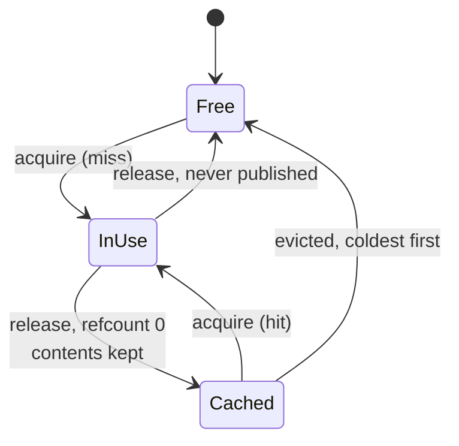

# 07 — Automatic Prefix Caching

## Principle

Project 03 shared a prefix the engine was *handed* up front. Real traffic doesn't
work like that. Prefixes appear on their own — many users hit the same system
prompt, a RAG pipeline reuses the same retrieved passage, and above all **a chat
turn is a strict extension of the turn before it.**

vLLM's answer is to make blocks content-addressable. Each full block gets a hash
chained through its parent:

$$h_i = H(h_{i-1},\ \text{tokens in block } i)$$

so one hash identifies the *entire prefix* up to that block, and two sequences
collide exactly when they genuinely share that prefix. No configuration, no
declared system prompt — the reuse is discovered.

The second half is retention. A finished sequence doesn't throw its blocks away:
they drop to refcount zero and sit in an **LRU pool**, still addressable, until
the space is actually needed.

## Three states a block can be in



`Cached` is the state that makes this work. A conventional allocator only has
*free* and *in use*, and freeing destroys the information.

## The two rules that matter

**Only full blocks are hashed.** A partial trailing block will still change, so
sharing it would be wrong. That's also why the demo's 192-token system prompt
doesn't align to the 16-token block size — the tail is genuinely unshareable.

**A hit is only usable behind an unbroken run of hits.** Attention needs a
contiguous prefix, so a hit at block 7 sitting behind a miss at block 3 buys
nothing. The code takes the block anyway and recomputes it:

```python
if hit and prefix_hits == index:
    prefix_hits += 1
```

**Publish after computing, not on allocation.** A block's hash is registered only
once every token in it has been through the model. Publishing early would let
another sequence read uninitialised K/V.

## Results

Three chats × four turns, interleaved the way a real server sees them, with a
192-token system prompt and 48-token user turns:

```
                              blocks  prompt tok  prefilled   reused   hits  evict   TTFT p50    wall
no prefix caching                256        4320       4320     0.0%      0      0      13.4ms   1.56s
prefix caching                   256        4320        912    78.9%    213      0       5.8ms   1.46s
prefix caching, 64 blocks         64        4320       1136    73.7%    212      7       5.5ms   1.44s

identical output : True
```

- **78.9% of prompt tokens never touched the model.** 4320 tokens of prompt, 912
  actually prefilled. The system prompt is reused across all three chats and every
  turn reuses the whole conversation before it.
- **TTFT halves**, 13.4ms → 5.8ms. That's the metric prefix caching moves. Total
  wall time barely shifts because decode dominates here — prefill is what gets
  skipped, so time-to-*first*-token is where it shows.
- **Under memory pressure it degrades gracefully.** At 64 blocks the LRU evicts 7
  times and the hit rate slips from 78.9% to 73.7%, rather than falling off a
  cliff.

`identical output: True` because a cached block holds K/V for exactly the tokens
its hash covers — reusing it is arithmetically the same as recomputing it.

## Why this compounds

Prefix caching gets *better* as conversations get longer, which is the opposite
of every other cost in the system. Turn $n$ of a chat re-sends $O(n)$ tokens, so
without caching prefill cost grows linearly with conversation depth; with caching
it stays proportional to the new turn.

## Run

```powershell
python prefix_caching.py
```

Requests are processed one at a time on purpose. The scheduling was project 02's
job; here the only variable is the cache, so nothing else moves.
