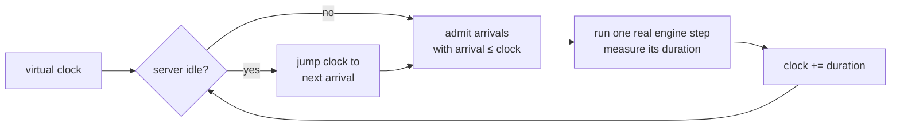

# 08 — Benchmark Harness

## Principle

Every project so far reported one number from one offline batch. That's not how a
server is judged. Requests arrive at some rate, and what matters is how many are
answered *well enough* — not how many tokens the box can emit.

So this measures what production teams actually optimise:

$$\text{goodput} = \frac{\text{requests completed within BOTH a TTFT and a TPOT deadline}}{\text{time}}$$

The point is that **throughput and goodput come apart**. Push past the knee and
the server keeps accepting work and keeps emitting tokens — raw throughput even
rises — while the fraction of requests anyone would call *answered* collapses. A
benchmark that prints tokens/sec alone cannot see this happen.

## Timing method

Arrivals are simulated against **real** service times:



Service costs are genuine — the model really runs. Queueing is exact, because a
request cannot be admitted before its arrival time. And idle time is skipped
rather than slept through, so a benchmark that models 20 seconds of traffic
doesn't take 20 seconds of your life.

Inter-arrival gaps are exponential, which is what a Poisson process is:
$\Delta t = -\ln(1-U)/\lambda$.

## Results

```
40 requests per point, Poisson arrivals, batch 4, 96-160 token prompts
SLO: TTFT <= 0.5s and TPOT <= 40ms

  offered    done    tok/s   TTFT p50   TTFT p99   TPOT p99   met SLO   goodput
      2/s    2.3/s      148      0.02s      0.04s       7.8ms      100%     2.3/s  #####.......
      4/s    3.3/s      207      0.02s      0.38s       9.3ms      100%     3.3/s  #######.....
      6/s    5.5/s      342      0.03s      0.48s       8.1ms      100%     5.5/s  ############
     10/s    7.3/s      479      0.42s      1.23s       8.0ms       52%     3.8/s  ########....
     20/s    8.0/s      509      1.63s      2.82s       8.2ms       12%     1.0/s  ##..........
```

Read the two trends against each other:

- **tok/s rises monotonically and then flattens** — 148, 207, 342, 479, 509. By
  every throughput-only metric, 20 req/s is the best operating point.
- **Goodput peaks at 6 req/s and then collapses** — 5.5, then 3.8, then 1.0. At
  20 req/s offered, **88% of requests miss the SLO.**

The server at 20 req/s is doing its maximum amount of work and satisfying almost
nobody. That is the failure mode goodput exists to catch.

## Which latency moved

Notice **TPOT barely changes** (7.8 → 8.2 ms) while **TTFT p50 goes up 80×**
(0.02s → 1.63s). That's diagnostic, and it tells you exactly where the queue is:

- The batch is capped at 4. Once it's full, extra arrivals wait in the queue and
  do nothing but accumulate TTFT.
- Sequences already *in* the batch are unaffected — they still get a token every
  step, so their TPOT is flat.

So the fix for this particular saturation is more concurrency (paged memory,
project 03) or a bigger batch, not a faster kernel. A benchmark that only reported
end-to-end latency would not have told you that.

## Why this belongs in the sequence

This is the instrument every other project should be measured with. Chunked
prefill in project 02 looked slightly *worse* on throughput and clearly better on
p99 stall — a single-number benchmark makes that trade invisible, a load sweep
makes it obvious. Same for quantization: 4-bit buys concurrency, and concurrency
only pays off on the load curve.

## Run

```powershell
python benchmark.py
```

Five load points, 40 requests each. The `#` column is goodput scaled to the peak,
so the shape of the curve is visible at a glance.
