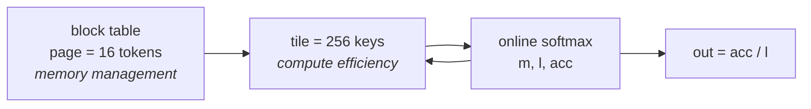

# 09 — Paged Attention Without the Gather

## Principle

Projects 03, 04 and 07 all read the cache the same way: follow the block table,
pull the whole context into one contiguous `[n, heads, ctx, d]` tensor, then run
softmax attention over it. Correct, readable — and it allocates the entire context
twice (K and V) plus an `[n, heads, s_q, ctx]` score matrix, **every layer, every
step**.

A real kernel never does that. It walks the block table *inside* the attention
loop, taking a tile of keys at a time and folding each one into a running result
with the **online-softmax recurrence**:

$$m' = \max(m,\ \text{rowmax}(s)), \qquad \alpha = e^{m - m'}$$
$$\ell \leftarrow \alpha \ell + \text{rowsum}(e^{s - m'}), \qquad
\mathbf{acc} \leftarrow \alpha \,\mathbf{acc} + e^{s - m'} V$$
$$\text{out} = \mathbf{acc} / \ell$$

$\alpha$ retroactively corrects everything accumulated so far for a new maximum,
which is what makes the result algebraically identical to one big softmax while
never holding one.

**Peak memory then depends on the tile, not on the context length.** That is the
whole trick behind FlashAttention, and behind vLLM's paged kernel.

## Two different block sizes



Page size and tile size answer different questions. The page is chosen to
minimise memory fragmentation (16 tokens, project 03). The tile is chosen to keep
the compute units fed — FlashAttention uses 64–128 keys regardless of the page
size. This file makes both knobs explicit, which is why `BLOCK_SIZE = 16` finally
stops being a magic number.

## Results

```
4 sequences, 8 q-heads / 2 kv-heads, d_k 64, page 16

decode: 1 query token over 4096 cached keys
                               max |err|   peak temp   smaller       time
  gather (materialised)         0.00e+00      64.51M        1x     9.14ms
  streaming, tile   16 keys     7.82e-08       0.26M      248x    70.57ms
  streaming, tile   64 keys     7.08e-08       1.02M       64x    21.34ms
  streaming, tile  256 keys     6.71e-08       4.04M       16x     7.88ms
  streaming, tile 1024 keys     5.96e-08      16.13M        4x    10.60ms

decode: 1 query token over 16384 cached keys
                               max |err|   peak temp   smaller       time
  gather (materialised)         0.00e+00     258.01M        1x    33.16ms
  streaming, tile   16 keys     9.31e-08       0.26M      992x   436.68ms
  streaming, tile   64 keys     8.75e-08       1.02M      254x    84.08ms
  streaming, tile  256 keys     8.57e-08       4.04M       64x    54.48ms
  streaming, tile 1024 keys     8.38e-08      16.13M       16x    37.25ms
```

Three readings:

- **The recurrence is exact.** Max error is $10^{-7}$, which is fp32 rounding.
  Nothing is approximated.
- **Memory ignores the context.** At tile 16 the temporaries are 0.26 MiB whether
  the context is 4k or 16k. The gather goes 64 MiB → 258 MiB over the same range.
  At 16k that's **992× less**.
- **There's a sweet spot even in Python.** Tile 256 beats the gather at 4k
  (7.88ms vs 9.14ms) while using 16× less memory, because it stops thrashing
  cache with a 64 MiB materialisation.

## The honest caveat

Small tiles are *slower* here — 436ms at tile 16 on a 16k context. The loop is
Python, so every tile pays interpreter and kernel-launch overhead. The algorithm
is right; the language is wrong.

In Triton or CUDA that loop lives inside one kernel launch, the tile stays in
registers and SRAM, and it is never written back to HBM at all. That is where the
speed comes from, and it's why the same recurrence that looks like a 40× slowdown
here is a 2–4× speedup in production. The file prints whether Triton is importable
so you can see which regime you're in.

## Why this closes the loop

This retires the one simulation caveat left standing in projects 03 and 04. Their
`gather` was labelled *"a real kernel fuses this into the attention itself instead
of materialising it"* — this is that fusion, written out.

## Run

```powershell
python fused_paged_attention.py
```

Pure tensor ops, no model, no training. Block tables are deliberately shuffled so
the gather does genuinely scattered reads rather than a disguised contiguous
slice.

Sources: Dao et al., *FlashAttention* ([arXiv:2205.14135](https://arxiv.org/abs/2205.14135)) ·
Milakov & Gimelshein, *Online normalizer calculation for softmax*
([arXiv:1805.02867](https://arxiv.org/abs/1805.02867))
