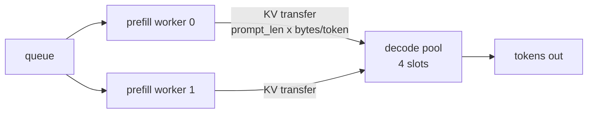

# 10 — Disaggregated Prefill and Decode

## Principle

Prefill and decode are not the same workload, and running them on the same device
means they fight.

| | Prefill | Decode |
|---|---|---|
| bound by | compute | memory bandwidth |
| shape | bursty, ∝ prompt length | steady, one token wide |
| governs | TTFT | TPOT |
| wants | large token batches | many concurrent sequences |

Sharing one device has three consequences: a long prefill occupies it and every
running decode **freezes** for the duration (the `max stall` column from project
02); the batch size that suits one doesn't suit the other; and you cannot buy TTFT
capacity without also buying decode capacity.

Disaggregation separates them. Prefill workers compute the prompt's K/V and
**ship it** to decode workers, which do nothing but decode.



The bill is the transfer: $\text{prompt\_len} \times \text{bytes per token}$ per
request, across the interconnect. Disaggregation only pays when prompts are long
enough that the interference costs more than the copy.

## How the difference is modelled

Both pools live in one process, so the distinction is made explicit in the clock:

- **Colocated** — `clock += t_prefill + t_decode`. One device does them in sequence.
- **Disaggregated** — `clock += max(t_prefill, t_decode)`. Two devices run at once.

Transfer is charged separately and in full; production overlaps it with compute,
so this is the pessimistic case. Every duration is a real measured forward pass.

## Results

Prompts 768–1536 tokens, replies 16–40 — the RAG shape, where prefill dominates:

```
24 requests at 6/s, 27314 prompt tokens, 3072 B of KV per token

                            wall   tok/s   TTFT p50   TTFT p99   TPOT p50  max stall   KV moved
colocated                  5.02s     134      0.29s      0.76s      17.7ms       166ms       0.0M
disaggregated 1P/4D        4.98s     135      0.20s      0.57s      16.6ms       152ms      80.0M
disaggregated 2P/4D        5.02s     134      0.10s      0.29s      11.5ms       118ms      80.0M

identical output : True
device time split : 48% prefill, 52% decode
```

- **TTFT p99 improves 2.6×** (0.76s → 0.29s) and p50 improves 2.9×.
- **TPOT improves too** (17.7 → 11.5 ms), because decode is no longer interrupted.
- **Wall time and throughput are flat.** This is the important nuance:
  disaggregation buys *latency*, not raw throughput. Total capacity is still set
  by the decode pool.

The headline claim is in the last row. Going from 1 prefill worker to 2 **halved
TTFT without touching decode capacity at all** — the two knobs became independent,
which is the entire point.

Note the split: prefill is 48% of device time here. In the colocated run, every
one of those seconds is a second the decode batch spends frozen. Shrink the
prompts and this whole technique stops being worth its transfer cost.

## The transfer is the design constraint

80 MiB moved for 24 requests, ~3.3 MiB each. At production scale with
`d_model` 4096 and 32 layers, a 4k-token prompt is hundreds of MiB per request —
which is why real deployments put prefill and decode nodes on the same NVLink
island or InfiniBand fabric, and why layer-wise streaming (send layer $i$'s K/V
while layer $i+1$ computes) matters so much.

`identical output: True` proves the copy is right: the decode pool continues from
transferred K/V and cannot tell the difference from having prefilled locally.

## Run

```powershell
python disaggregated.py
```

Poisson arrivals against a virtual clock, same instrument as project 08.
Best-of-two per configuration, since the clock accumulates real measured
durations and a busy CPU is noisy.

Sources: Zhong et al., *DistServe* ([arXiv:2401.09670](https://arxiv.org/abs/2401.09670)) ·
Patel et al., *Splitwise* ([arXiv:2311.18677](https://arxiv.org/abs/2311.18677))
